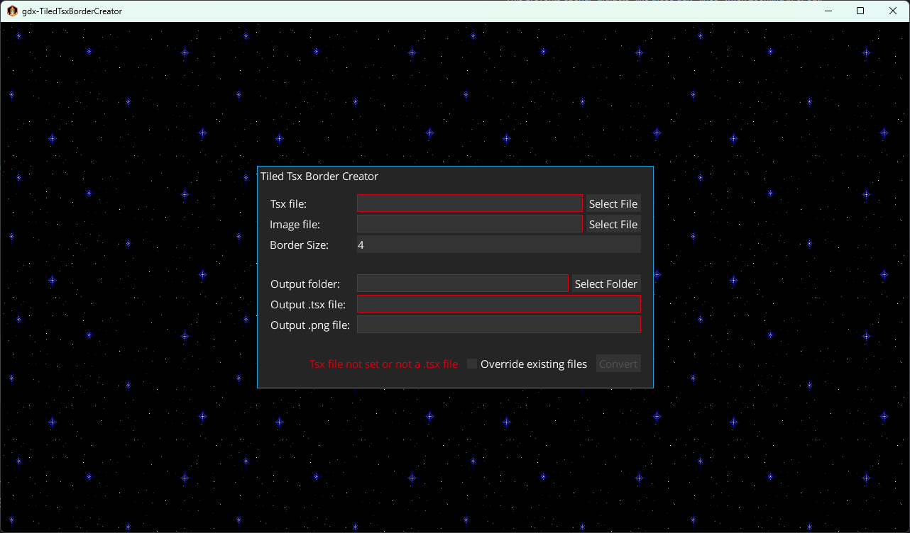
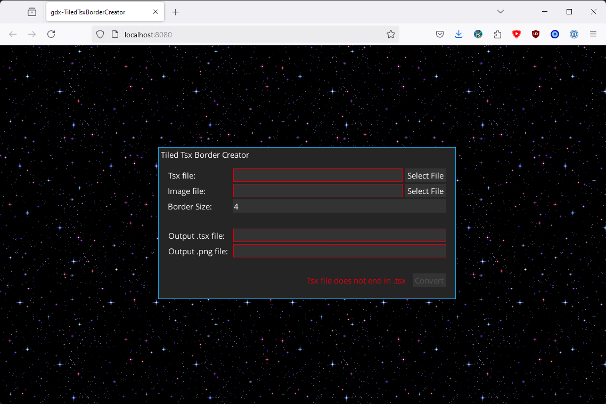
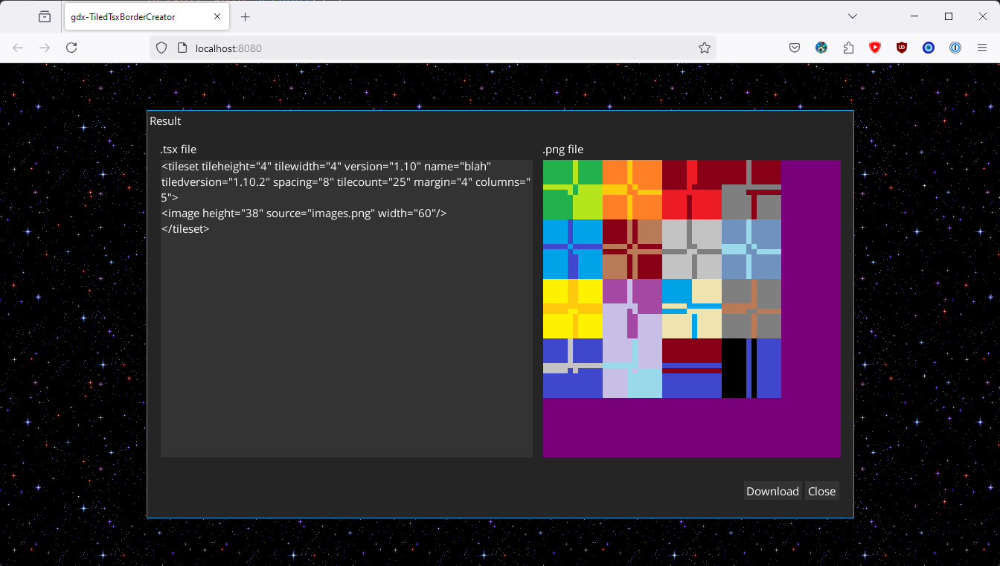
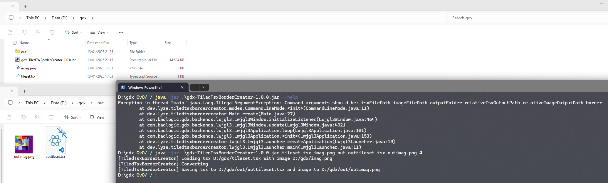

# gdx-TiledTsxBorderCreator

A project to add "padding" to tiled tilesets.

This prevents opengl "artifacts" like those ugly "lines" when zooming in or out.

### Screenshots

| Desktop Interface                      | Browser Interface                      | Result Interface                     | Console Interface                      |
|----------------------------------------|----------------------------------------|--------------------------------------|----------------------------------------|
|  |  |  |  |

### How to run:

#### If you want to use the jar file or build from source, make sure that you have [java jdk 17+](https://bell-sw.com/pages/downloads/) installed.

Alternatively, you can [download](https://github.com/lyze237/gdx-TiledTsxBorderCreator/releases) windows or linux zip files which include jres

#### There are five ways to run the app:

1. Interactive desktop mode:
    1. Download the desktop jar from the [releases](https://github.com/lyze237/gdx-TiledTsxBorderCreator/releases) page
    2. Run it via `java -jar gdx-TiledTsxBorderCreator-desktop.jar`
2. Commandline mode:
    1. Download the desktop jar or headless jar (This is useful when your computer doesn't have a graphics card. For example in a vm,
       github actions or docker) from the [releases](https://github.com/lyze237/gdx-TiledTsxBorderCreator/releases) page
    2. Run `java -jar gdx-TiledTsxBorderCreator-headless.jar --help` to see a help screen with what parameters you need to use
    3. Run it via `java -jar gdx-TiledTsxBorderCreator-headless.jar input.tsx input.png outputfolder out.tsx out.png bordersize`
3. Website:
    1. Open https://lyze237.github.io/gdx-TiledTsxBorderCreator/
4. Gradle task:
    1. Check [jitpack.io](https://jitpack.io/#lyze237/gdx-TiledTsxBorderCreator) for the latest version
    2. Open the root `build.gradle` file of your project
    3. Inside the `buildscript {}` section:
       1. Inside `buildscript { repositories { } }` add `maven { url 'https://jitpack.io' }`
       2. Inside `buildscript { dependencies { } }` add `classpath "com.github.lyze237.gdx-TiledTsxBorderCreator:headless:VERSION"` and replace VERSION with the version from jitpack
    4. Add a new gradle task: 
        ```groovy
        import dev.lyze.tiledtsxbordercreator.headless.HeadlessLauncher
        task addBorderToTiles{
            doLast {
                HeadlessLauncher.main(new String[] {"--help"})
            }
        }
        ```
    5. See "Commandline mode" for what arguments you need to pass.
    
        Full example: 
        ```groovy
        buildscript {
          repositories {
            // ...
            maven { url 'https://jitpack.io' }
          }
          dependencies {
            // ...
            classpath "com.github.lyze237.gdx-TiledTsxBorderCreator-Test:headless:v1.0.3" // remember to update the version to the latest version
          }
        }

        import dev.lyze.tiledtsxbordercreator.headless.HeadlessLauncher
        task padTiles {
          doLast {
            HeadlessLauncher.main(new String[] {"--help"})
          }
        }
        ```
5. As a library:
    1. Check [jitpack.io](https://jitpack.io/#lyze237/gdx-TiledTsxBorderCreator) for the latest version
    2. Open the `build.gradle` file of your module
    3. Inside `dependencies {  }` add `implementation "com.github.lyze237.gdx-TiledTsxBorderCreator:headless:VERSION"`
    4. Then use it like this:
        ```java
        var borderCreator = new TiledTsxBorderCreator(Gdx.files.local("input.tsx"), Gdx.files.local("input.png"));
        var result = borderCreator.convert("output.tsx", "output.png", 4);
        borderCreator.writeResult(result, Gdx.files.local("out"), "output.tsx", "output.png", new CommandLineNatives());
        ```

### Run from source:

1. Clone the repo
2. Run `./gradlew.bat jar` to create jar files in `lwjgl3/build/libs` or `headless/build/libs`
3. Then refer to "How to run" with either one of the two jar files
